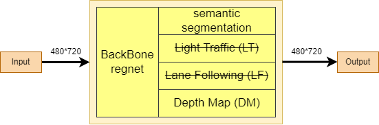

# Backbone model and training architecture

## Architecture

<figure>

  <figcaption>illustration of robot </figcaption>
</figure>

### Type of backbone's used
Use regnet model

### Headers
Header depth map est en int16 est représente la profondeur en mm (uint16)
Header segmentation en int8 avec matric => [480][720][N_class]
### Training phase
Phase 1 d'entrainement :
La phase d'entrainement des header's backbone sont générées par le simulateur de carla

La backbone sera donc péformante dans le monde de carla. Cela permet de voir si elle marche bien 

