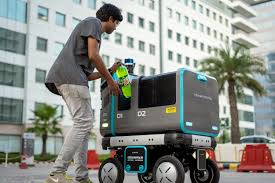

# Create our autonomous robot

## specifications

* Robot operating only on a pedestrian lane and cycle path
* Using google map to have GPS's pointway
* Have a smaller ai model as possible
* Have to take considerations of all road signalitics :
  * Speed limitation
  * Road lane
  * Human and object collision
  * Sheet collision (on the road)

### Create our ai model

First objectif :
From carla software simulation environment :

* Scripte simulation with automatic and manuel
* AI model (ARchitecture and dataflow)
* Architecture of training model
* Scripte of evaluation performance model

### Hardware specification

* 2 camera min 1080p
* GPS
* Acces to google map (online or offline)
* Robot

<figure>

  <figcaption>illustration of robot </figcaption>
</figure>

### Robot architecture

<figure>

  <figcaption>Ai model architecture </figcaption>
</figure>

<figure>
  
  <figcaption>Robot architecture </figcaption>
</figure>
